  <!-- Terminal header -->
  

  <!-- Terminal bio -->
  

$ whoami 
Java &amp; Spring Boot engineer building secure full stack systems. Final year CS student, SOC intern, open source contributor. RedHat Certified SysAdmin specializing in automation, DevOps, Linux, and cybersecurity backed by real projects in network forensics, face recognition, and scalable Java platforms. Pretoria, South Africa.
  

   

  <!-- --- TERMINAL NAV --- -->

  <table align="center" border="0" cellpadding="0" cellspacing="0">
    <tr>
      <td style="padding: 4px;">
        
      </td>
      <td style="padding: 4px;">
        
      </td>
      <td style="padding: 4px;">
        
      </td>
      <td style="padding: 4px;">
        
      </td>
      <td style="padding: 4px;">
        <a href="https://github.com/Lintshiwe"
           style="display: inline-flex; align-items: center; gap: 8px; color: #00ff41; text-decoration: none; font-family: monospace; font-size: 13px; padding: 8px 16px; border: 1px solid #1a3a1a; border-radius: 4px; white-space: nowrap;">
          
          Lintshiwe
        </a>
      </td>
    </tr>
  </table>

<pre style="color: #1a3a1a; text-align: center; font-size: 10px; line-height: 1.2; margin: 20px 0;">
────────────────────────────────────────────────────────────────────────────────
</pre>

<!-- --- GITHUB ANALYTICS --- -->

<h2 style="font-size: 0.78rem; font-weight: normal; letter-spacing: 0; text-transform: none; color: #00cc33; font-family: monospace; margin-bottom: 20px; padding-bottom: 0; border: none;">
$ ./stats.sh --profile=Lintshiwe
</h2>

  
  
  

    

  <table align="center" border="0" cellpadding="0" cellspacing="0">
    <tr>
      <td style="border: 1px solid #1a3a1a; border-radius: 6px; padding: 6px;">
        
      </td>
      <td width="14"></td>
      <td style="border: 1px solid #1a3a1a; border-radius: 6px; padding: 16px; vertical-align: top;">
        

          # Core Languages
        

        

          
          
          
          
        

         
        

          # Automation &amp; Tooling
        

        

          
          
          
          
        

      </td>
    </tr>
  </table>

   

  

    
  

<pre style="color: #1a3a1a; text-align: center; font-size: 10px; line-height: 1.2; margin: 20px 0;">
────────────────────────────────────────────────────────────────────────────────
</pre>

<!-- --- TECH STACK --- -->

<h2 style="font-size: 0.78rem; font-weight: normal; letter-spacing: 0; text-transform: none; color: #00cc33; font-family: monospace; margin-bottom: 20px; padding-bottom: 0; border: none;">
$ cat tech-stack.txt
</h2>

  

<pre style="color: #1a3a1a; text-align: center; font-size: 10px; line-height: 1.2; margin: 20px 0;">
────────────────────────────────────────────────────────────────────────────────
</pre>

<!-- --- CERTIFICATIONS & ACHIEVEMENTS --- -->

<h2 style="font-size: 0.78rem; font-weight: normal; letter-spacing: 0; text-transform: none; color: #00cc33; font-family: monospace; margin-bottom: 20px; padding-bottom: 0; border: none;">
$ cat ~/certs/credentials.md
</h2>

  
Red Hat Certified System Administrator

  

    

  
# Badges

  

<pre style="color: #1a3a1a; text-align: center; font-size: 10px; line-height: 1.2; margin: 20px 0;">
────────────────────────────────────────────────────────────────────────────────
</pre>

<!-- --- LET'S CONNECT --- -->

<h2 style="font-size: 0.78rem; font-weight: normal; letter-spacing: 0; text-transform: none; color: #00cc33; font-family: monospace; margin-bottom: 20px; padding-bottom: 0; border: none;">
$ finger lintshiwe
</h2>

  

    # Collaborating on cinematic UI, secure engineering, and community labs
  

  <table align="center" border="0" cellpadding="0" cellspacing="0">
    <tr>
      <td style="padding: 5px;">
        
      </td>
      <td style="padding: 5px;">
        
      </td>
      <td style="padding: 5px;">
        
      </td>
      <td style="padding: 5px;">
        
      </td>
    </tr>
  </table>

<pre style="color: #1a3a1a; text-align: center; font-size: 10px; line-height: 1.2; margin: 20px 0;">
────────────────────────────────────────────────────────────────────────────────
</pre>

   

  

    $ echo "Resilience by design. Delight by default."
  

  

    # &copy; 2026 Lintshiwe Ntoampi
  

